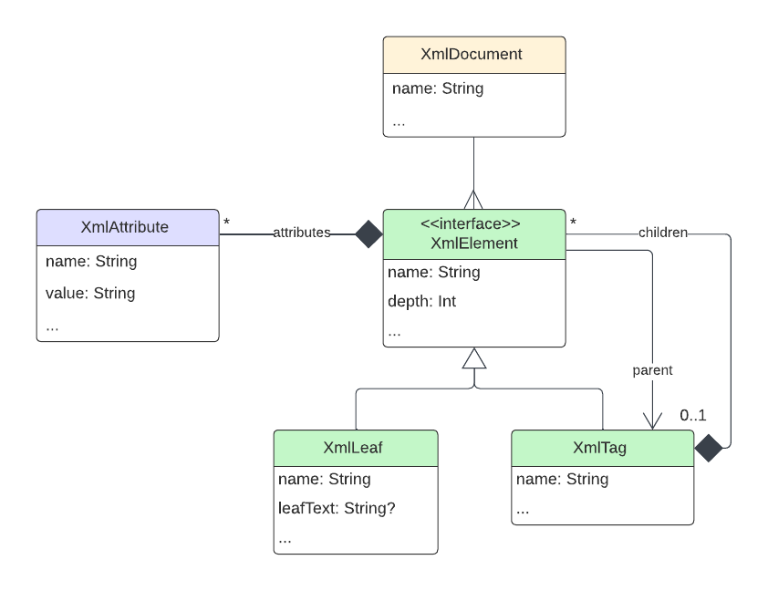

# XML Manipulation Library

Final project by Susana Ferreira & Tomás Fragoso

Advanced Programming class\
Masters in Informatics Engineering\
ISCTE - Instituto Universitário de Lisboa\
2023/2024

## About the Project
With this library the user can build XML entities out of objects they provide.\
This library does not read XML files as input.

The Classes in this project relate to one another as pictured in the following UML diagram:


## Using the API
In this section we´ll look at the classes and annotations and what can be achieved with them, with examples of usage.

### `Classes`

### XmlDocument
<p>This class is the aggregator of the entire xml. Saves the xml configuration and its content.</p>

> **Constructors** 
>
>| Name       | Type       | Required   |
>|------------|------------|------------|
>| name       | String     | yes        |
>| body       | XmlTag     | yes        |
>| config     | XmlLeaf    | no         |
>
>Example<br>
><code>val plano = XmlTag("plano")</code><br>
><code>val doc = XmlDocument("document", plano)</code>
>
> **Methods** 
>* renameElements 
>* removeElements
>* addAttributeGlobally
>* renameAttributeGlobally
>* removeAttributeGlobally
>* microXpath
>* prettyPrint

### XmlElement

This is the abstract interface that includes the class XmlLeaf and the composite XmlTag.
> **Constructors** 
>
>| Name       | Type       | Required   |
>|------------|------------|------------|
>| name       | String     | yes        |
>
> **Methods** 
>* accept 
>* addAttribute
>* removeAttribute
>* updateAttribute
>* listDistinctElementNames
>* elementToString
>* isValidElementName

### XmlTag

This is the composite class that represents a xml entity with other elements nested in it (children).
> **Constructors** 
>
>| Name       | Type                      | Required   |
>|------------|---------------------------|------------|
>| name       | String                    | yes        |
>| parent     | XmlTag                    | no         |
>| attributes | MutableList<XmlAttribute> | no         |
>
>Example<br>
><code>val plano = XmlTag("plano")</code><br>
><code>val fuc1 = XmlTag("fuc", plano)</code>
>
> **Methods** 
>* addChildElement 
>* removeChildElement
>* accept
>* mapXml

### XmlLeaf

This class represents a final xml entity, i.e, with no elements nested in it (children).
> **Constructors** 
>
>| Name       | Type                      | Required   |
>|------------|---------------------------|------------|
>| name       | String                    | yes        |
>| parent     | XmlTag                    | no         |
>| attributes | MutableList<XmlAttribute> | no         |
>| leafText   | String                    | no         | 
>
>Example<br>
><code>val plano = XmlTag("plano")</code><br>
><code>val curso = XmlLeaf("curso", plano, leafText = "MEI")</code>
>
> **Methods** 
>* mapXmlLeaf

### XmlAttribute
<p>This class defines a xml attribute with a name and a value. Is used by XmlElement, XmlDocument, XmlTag and XmlLeaf to define the list of attribute given to a xml tag or leaf.</p>

>**Construtors** 
>
>| Name       | Type       | Required   |
>|------------|------------|------------|
>| name       | String     | yes        |
>| value      | XmlTag     | yes        |
>
>Example<br>
>**Kotlin**&nbsp;&nbsp;&nbsp;<code>val fuc1 = XmlTag("fuc", plano, mutableListOf(XmlAttribute("codigo", "M4310")))</code><br>
>**Xml**&nbsp;&nbsp;&nbsp;&nbsp;&nbsp;&nbsp;<code>val doc = XmlDocument("document", plano)</code>
>
> **Methods** 
>* getName 
>* getValue
>* setName
>* setValue
>* isValidAttributeName
>* isValidAttributeValue
>
>Example<br>
><code>val plano = XmlTag("plano")</code><br>
><code>val doc = XmlDocument("document", plano)</code>

### `Annotations`

### Leaf

> **Target** Property
>
> **Description** Identify a final element 
>
>| XML Example  | Kotlin Usage|
>|------------|------------|
>| ```<nome>Programação Avançada</nome> ```| <code> @Leaf</code><br><code>val nome: String,</code>|

### Attribute

>**Target** Property
>
>**Description** Identify an attribute
>| XML Example  | Kotlin Usage|
>|------------|------------|
>| ```<fuc codigo="M4310">```| <code>class FUC</code><br><code>&nbsp;&nbsp;&nbsp;&nbsp;@Attribute</code><br><code>&nbsp;&nbsp;&nbsp;&nbsp;var codigo: String,</code>|

### Inline

>**Target** Property
>
>**Description** Identify an element without an aggregator
>| XML Example  | Kotlin Usage|
>|------------|------------|
>| ``` <plano> ```<br>&nbsp;&nbsp;&nbsp;&nbsp;```<fuc codigo="M4310">```<br>&nbsp;&nbsp;&nbsp;&nbsp;&nbsp;&nbsp;&nbsp;&nbsp;``` <ects>6.0</ects> ```<br>&nbsp;&nbsp;&nbsp;&nbsp;``` </fuc> ```<br> &nbsp;&nbsp;&nbsp;&nbsp;``` <fuc codigo="03782"> ```<br>&nbsp;&nbsp;&nbsp;&nbsp;&nbsp;&nbsp;&nbsp;&nbsp;``` <ects>42.0</ects> ```<br> &nbsp;&nbsp;&nbsp;&nbsp;``` </fuc> ```<br> ``` </plano> ```| <code>class Plano(</code><br><code>&nbsp;&nbsp;&nbsp;&nbsp;@Inline</code><br><code>&nbsp;&nbsp;&nbsp;&nbsp;val fuc:List&lt;FUC&gt;</code><br><code>)</code>|

### Nested

>**Target** Property
>
>**Description** Identify an element with an aggregator
>| XML Example  | Kotlin Usage|
>|------------|------------|
>| ``` <fuc codigo="M4310"> ``` <br> &nbsp;&nbsp;&nbsp;&nbsp;``` <avaliacao> ```<br> &nbsp;&nbsp;&nbsp;&nbsp;&nbsp;&nbsp;&nbsp;&nbsp;```<componente nome="Quizzes" peso="20%"/>```<br> &nbsp;&nbsp;&nbsp;&nbsp;&nbsp;&nbsp;&nbsp;&nbsp;```<componente nome="Projeto" peso="80%"/>```</code><br><code>&nbsp;&nbsp;&nbsp;&nbsp;```</avaliacao>```</code><br><code>``` <\fuc> ```| <code>class FUC(</code><br><code>&nbsp;&nbsp;&nbsp;&nbsp;@Nested</code><br><code>&nbsp;&nbsp;&nbsp;&nbsp;val avaliacao: List&lt;Componente&gt;</code><br><code>)</code>|

### XmlString

>**Target** Property
>
>**Description** Apply user-defined function to an element (in this example, adds a percentage to the attribute value)
>| XML Example  | Kotlin Usage|
>|------------|------------|
>| ```<componente nome="Quizzes" peso="20%"/>```| <code>@XmlString(AddPercentage::class,function="addPercentage")</code><br><code>val peso: Any</code>|

### XmlAdapter

>**Target** Class
>
>**Description** Apply user-defined function to the element after mapping (in this example, changes an attribute value)
>| XML Example  | Kotlin Usage|
>|------------|------------|
>| Before<br>```<fuc codigo="M4310">```<br><br>After<br>```<fuc codigo="AAAAAA23657">```| <code>@XmlAdapter(FUCAdapter::class)</code><br><code>class FUC(</code><br><code>&nbsp;&nbsp;&nbsp;&nbsp;@Attribute</code><br><code>&nbsp;&nbsp;&nbsp;&nbsp;var codigo: String</code><br><code>)</code><br><br><code>class FUCAdapter {</code><br><code>&nbsp;&nbsp;&nbsp;&nbsp;fun ChangeCodigoValue(objFuc:FUC, newValue:String){</code><br><code>&nbsp;&nbsp;&nbsp;&nbsp;objFuc.codigo= newValue</code><br><code>&nbsp;&nbsp;&nbsp;&nbsp;}</code><br><code>}</code><br><br><code>FUCAdapter().ChangeCodigoValue(f,"AAAAAA23657")</code>|
